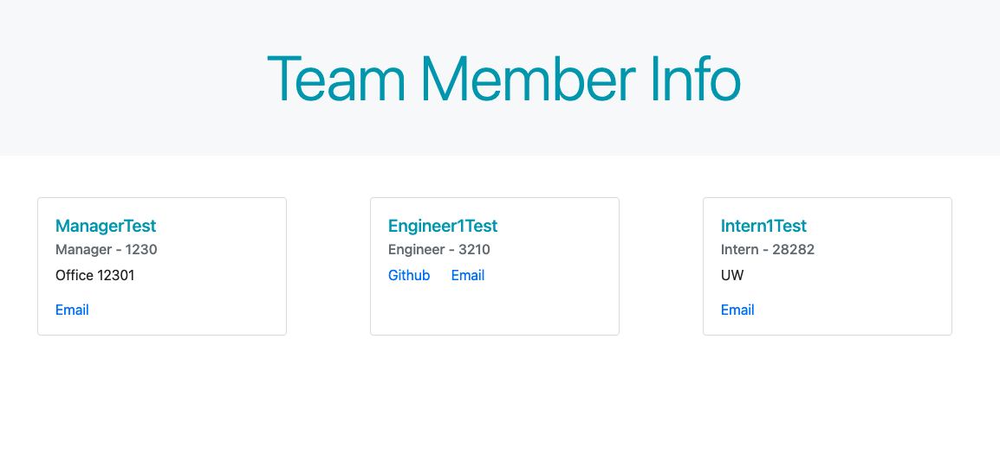

# Notetaker

## Description 

An application that builds a profile for a team - Manager, Engineer, & Intern - by prompting questions about the members, taking the inputed data, and then generating an HTML document with the data. Also utilizes Jest and tests for debugging. 

## Table of Contents
* [Links](#links)
* [Technologies](#technologies)
* [Usage](#usage)
* [Screenshots](#screenshots)
* [Demo](#demo)

## Links 

* Local: See [Usage](#Usage) for local setup instructions 

## Technologies

* HTML
* CSS / Bootstrap
* Javascript
* Node.js
* FS Node.js 
* Inquirer
* Jest 

## Usage 

* If you do not have `Node.js` installed, [click here](https://nodejs.org/en/) to download and install. 
* While in a terminal within the root directory of the application, run the command `npm install` to install the required modules/packages. 
* Once this finishes, run `npm start` or `node index.js`. 
* Fill out the questions prompted about employee info, and select "Done" once you are finished. 
* An HTML file will then be generated, and appear in the root folder. Open this file in a browser to view. 
* If you would like to run the tests, enter `npm test` in the terminal - it will show what has passed/failed. 

## Screenshots

## Demo

